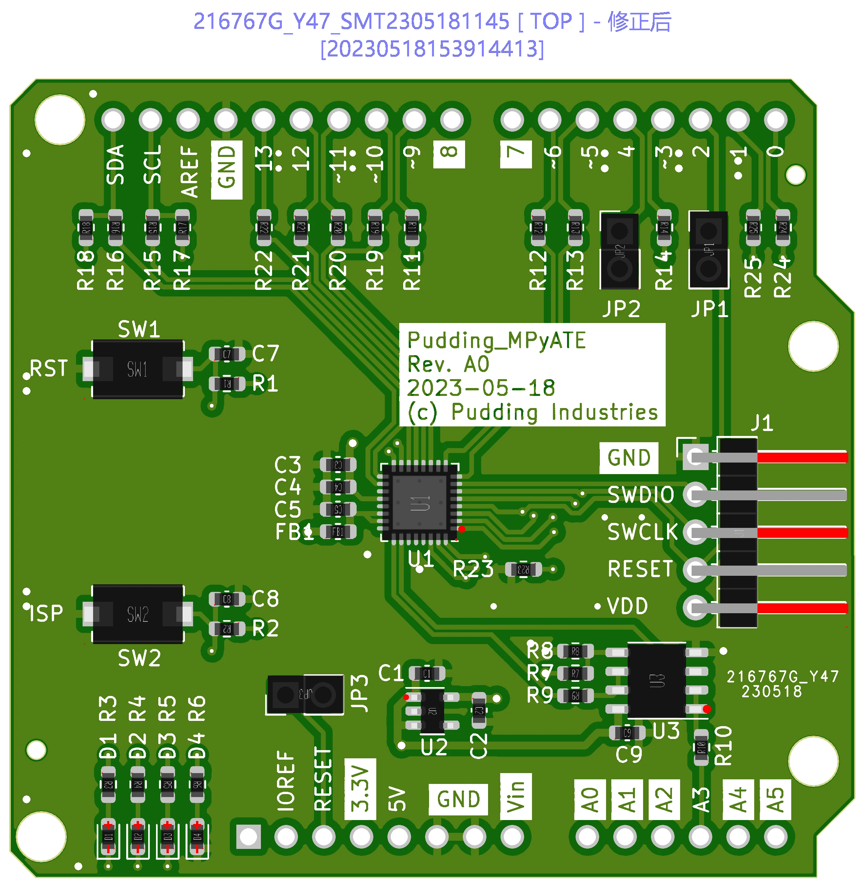

# MicroPython ATE Shield

## Why

This board is created trying to solve the following problem in MicroPython project:

> What if the code compiles, but does not work as intended?

So an idea came up by @robert-hh, that we can make these testes automated with a "shield" (See [here](https://github.com/micropython/micropython/pull/11516))

Some peripherals *CAN* be verified by connecting to itself, such as UART and GPIO, while others can't be easily verified without some on-board devices like sensors or EEPROMs. So instead of mounting all sensors on a board, a cheap MCU is used to *act like* some peripherals, which can produce controllable and repeatable results to DUT.

This board can be used to verify the following peripheral drivers:

* ADC
* UART
* SPI
* I2C
* PWM
* GPIO

## LPC804
Why LPC804?

* Cheap enough
* Fully 5V IO tolarent
* Has an DAC(!)
* Switch Matrix
